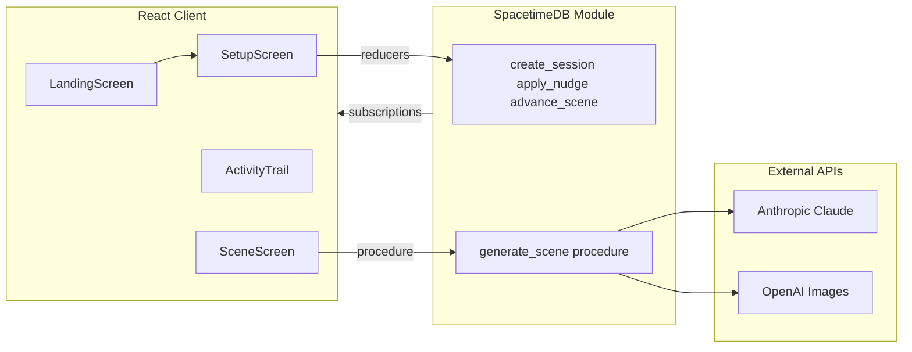

# Inkwell

[](https://github.com/nayanikar/inkwell)

Inkwell is an AI comic strip engine. You define a genre, setting, and cast of characters; a SpacetimeDB module writes scene scripts with Claude and generates panel artwork with OpenAI; the React client renders the comic in real time as rows sync over subscriptions.

**Stack:** SpacetimeDB 2.4 (TypeScript module), React 18, Vite, Tailwind 4, Anthropic Claude (scene scripts), OpenAI `gpt-image-2` (panels), browser Web Speech API (narration + voice nudges).

**Repository:** https://github.com/nayanikar/inkwell

---

## User flow

1. **Landing** — hero screen with “Start a new story” (resume in-progress story from the header when saved)
2. **Setup** — two-column story director form (genre, scene count, setting, 2–4 characters)
3. **Scene** — live comic view with acts rail, activity trail, and “direct the next scene” rail
4. **Session** — overview grid of all scenes

Landscape-first layout: viewport-locked screens with no page scroll on the main comic experience.

---

## Architecture



**Flow:** Setup form → `create_session` reducer → `generate_scene` procedure → panels stream into the client via SpacetimeDB subscriptions. Nudges insert `narrative_directive` rows and trigger the next scene. The **SpacetimeDB trail** in the left sidebar shows module activity (row inserts, procedure steps, subscription updates) as generation happens.

---

## SpacetimeDB configuration

| File | Purpose |
|------|---------|
| [`spacetime.json`](spacetime.json) | Database `inkwell`, module `./spacetimedb`, server `http://127.0.0.1:3001`, bindings → `./src/module_bindings` |
| [`spacetime.local.json`](spacetime.local.json) | Local database name override (gitignored) |
| [`spacetimedb/.env`](spacetimedb/.env) | `ANTHROPIC_API_KEY`, `OPENAI_API_KEY` — copy from [`spacetimedb/.env.example`](spacetimedb/.env.example) |
| [`.env.local`](.env.local) | `VITE_SPACETIMEDB_HOST`, `VITE_SPACETIMEDB_DB_NAME` — copy from [`.env.local.example`](.env.local.example) |
| [`scripts/inject-env.mjs`](scripts/inject-env.mjs) | Bakes API keys into `spacetimedb/src/lib/env.generated.ts` for module publish only. Gitignored. |

SpacetimeDB modules cannot read `process.env` at runtime. Keys are injected at **module publish time** via `inject-env.mjs` (run automatically by `npm run dev:publish`). Keys live in the published module WASM bundle on your SpacetimeDB host, not in the Vite client bundle. The browser client never receives API keys.

**Ports:** Local SpacetimeDB listens on **3001** (`npm run dev:stdb`). The Vite client defaults to `ws://localhost:3001` (see `src/lib/stdb.ts`). App URL: **http://localhost:5174**.

---

## Database schema

Six public tables in [`spacetimedb/src/index.ts`](spacetimedb/src/index.ts):

| Table | Role |
|-------|------|
| `session` | Story metadata: `genre`, `setting`, `style_bible`, `total_scenes`, `current_scene`, `status` |
| `character` | Cast per session: name, archetype, personality, `current_mood`, `secret` |
| `scene` | One row per act/scene: `title`, optional `scene_summary`, `status` (`generating` → `done` or `error`) |
| `panel` | Comic frame: caption, speaker, dialogue, `image_prompt`, `image_url`, `layout_hint`, `status` |
| `narrative_directive` | User nudges: `type`, `content`, `applied_at_scene` |
| `memory` | Per-character story memory (written by `generate_scene`; subscribed but not yet shown in UI) |

---

## Reducers and procedures

| Operation | Type | When called |
|-----------|------|-------------|
| `create_session` | reducer | Setup form — validates 2–4 characters, builds style bible |
| `apply_nudge` | reducer | Preset or custom/voice directive; targets `current_scene + 1` |
| `advance_scene` | reducer | Next scene button or after nudge |
| `generate_scene` | procedure | After create/advance — Claude script + sequential OpenAI images |
| `update_character_mood` | reducer | Public API; primary updates come from `generate_scene` JSON |
| `append_memory` | reducer | Public API; primary inserts come from `generate_scene` JSON |

---

## `generate_scene` pipeline

Implemented in [`spacetimedb/src/index.ts`](spacetimedb/src/index.ts):

1. **Read context** — session, characters, memories (last 2 scenes), directives for `sceneNum`
2. **Claude** — `buildScenePrompt()` with dramatic structure, voice cards, subtext ([`storyQuality.ts`](spacetimedb/src/lib/storyQuality.ts))
3. **Insert rows** — delete stale scene/panels for regen; insert `scene` + `panel` rows (`status=generating`)
4. **Image loop** — per panel: `buildPanelImagePrompt()` → OpenAI `gpt-image-2` → update `panel.image_url`
5. **Finalize** — scene `status=done`, character mood updates, new memories, session `setup` → `running`

Prompt helpers live in [`spacetimedb/src/lib/prompts.ts`](spacetimedb/src/lib/prompts.ts). See [`STORY_QUALITY_AND_VOICE.md`](STORY_QUALITY_AND_VOICE.md) for narrative and voice design notes.

---

## Client data flow

| Piece | Location | Role |
|-------|----------|------|
| Connection | [`src/main.tsx`](src/main.tsx), [`src/lib/stdb.ts`](src/lib/stdb.ts) | `SpacetimeDBProvider`, WebSocket to local DB |
| Subscriptions | [`src/lib/stdb.ts`](src/lib/stdb.ts) | `subscribeToAllSessions` on connect; `subscribeToSession` per active story |
| Data hooks | [`src/lib/hooks.ts`](src/lib/hooks.ts) | `useSession`, `useScenePanels`, `useStoryActs`, `useSceneDirectives` |
| Session logic | [`src/hooks/useInkwellSession.ts`](src/hooks/useInkwellSession.ts) | Screen routing, reducers/procedures, saved session |
| Screens | [`src/screens/`](src/screens/) | Landing → Setup → Scene ↔ Session overview |
| Activity trail | [`src/lib/activityTrail.ts`](src/lib/activityTrail.ts), [`StoryThread`](src/components/StoryThread.tsx) | SpacetimeDB event log in left sidebar |
| Voice | [`useSpeechRecognition`](src/hooks/useSpeechRecognition.ts), [`useSceneNarration`](src/hooks/useSceneNarration.ts) | Mic nudge, Web Speech narration with panel highlight |

Generated bindings in [`src/module_bindings/`](src/module_bindings/) — do not edit; regenerate with `npm run dev:publish`.

---

## UI and typography

Ink-on-paper aesthetic with dot-grain background (`paper-grain` in [`src/index.css`](src/index.css)).

| Role | Font |
|------|------|
| Display headings | [Permanent Marker](https://fonts.google.com/specimen/Permanent+Marker) (`font-display`) |
| Labels, pills, footer | [Special Elite](https://fonts.google.com/specimen/Special+Elite) (`font-mono`) |
| Body, inputs, placeholders | [Caveat](https://fonts.google.com/specimen/Caveat) (`font-body`) |

Design tokens: `paper` (#f5f0e8), `ink` (#1a1612), `ink-muted` (#7a6e5f), `hairline` (#c8bfad), `accent-ink` (#c9510c).

---

## Local development

**Prerequisites:** Node.js, [SpacetimeDB CLI](https://spacetimedb.com/install), Anthropic + OpenAI API keys.

```bash
# 1. Clone and install
git clone https://github.com/nayanikar/inkwell.git
cd inkwell
npm install
cd spacetimedb && npm install && cd ..

# 2. API keys (module — required for generation)
cp spacetimedb/.env.example spacetimedb/.env
# Edit spacetimedb/.env — set ANTHROPIC_API_KEY and OPENAI_API_KEY

# 3. Client env (optional — defaults match local dev)
cp .env.local.example .env.local

# 4. Terminal A — SpacetimeDB server
npm run dev:stdb

# 5. Terminal B — publish module + regenerate TypeScript bindings
# Run after any change under spacetimedb/src/
npm run dev:publish

# 6. Terminal C — Vite client
npm run dev
# Open http://localhost:5174
```

**Other scripts:**

| Script | Description |
|--------|-------------|
| `npm run build` | TypeScript → Vite production build (no API keys in client bundle) |
| `npm run dev:all` | SpacetimeDB `spacetime dev` wrapper (server + publish + client) |
| `npm run preview` | Serve production build locally |
| `npm run spacetime:generate` | Regenerate client bindings only |
| `npm run spacetime:publish:local` | Publish module to `--server local` without inject-env |
| `npm test` | Vitest (configured; add tests under `src/` as needed) |

---

## Project structure

```
inkwell/
├── spacetimedb/src/
│   ├── index.ts           # Schema, reducers, generate_scene procedure
│   └── lib/               # prompts, storyQuality, anthropic, openai, style
├── src/
│   ├── App.tsx            # Shell + screen switch
│   ├── hooks/             # useInkwellSession, narration, speech recognition
│   ├── screens/           # LandingScreen, SetupScreen, SceneScreen, SessionScreen
│   ├── components/        # Comic grid, rails, trail, InkwellPageShell
│   ├── lib/               # stdb, hooks, types, domain logic
│   ├── mock/              # Preview fixtures only
│   └── module_bindings/   # Generated SpacetimeDB client (do not edit)
├── scripts/inject-env.mjs
├── spacetime.json
└── STORY_QUALITY_AND_VOICE.md
```

---

## Known limitations

- **Module API keys** are compiled into the SpacetimeDB module bundle at `npm run dev:publish` — they run on your SpacetimeDB host when procedures call Claude/OpenAI, not in the browser. Suitable for local/self-hosted demos; do not publish modules with live keys to untrusted public hosts.
- **Narration** uses the browser Web Speech API only (no OpenAI TTS in the client). Quality and voices vary by browser/OS.
- **Browsing past acts** is read-only: nudge and “next scene” are disabled until you select the live act (`sceneNum === session.current_scene`).
- **Memory table** is written by `generate_scene` but not yet shown in the UI.
- **Speech recognition** for voice nudges works best in Chrome; Safari support is limited.

---

## License

Private hackathon project.
