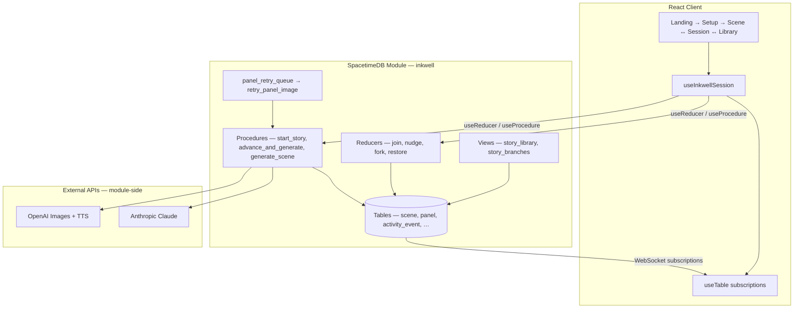

# Inkwell

[](https://github.com/nayanikar/inkwell)

**A comic, drawn live.**

Inkwell is an AI-native collaborative comic engine built natively on [SpacetimeDB](https://spacetimedb.com). You act as a director: define a genre, setting, and cast, then watch each scene become a full comic page in real time as rows commit over WebSocket subscriptions. Co-directors join via invite link, nudge the story together, fork alternate timelines, browse generation history, and follow every pipeline step in a live SpacetimeDB activity trail.

**Live demo:** [https://inkwell-opal.vercel.app](https://inkwell-opal.vercel.app)  
**Repository:** [https://github.com/nayanikar/inkwell](https://github.com/nayanikar/inkwell)

---

## What Inkwell Does

Inkwell turns collaborative storytelling into a live comic production:

1. **Setup** — Pick a genre, scene count, setting, and 2–4 characters with archetypes, personalities, moods, and secrets.
2. **Generate** — The SpacetimeDB module calls **Anthropic Claude** for scene scripts and **OpenAI** for page and panel artwork, plus server-side TTS narration.
3. **Direct** — Preset nudges, custom text, or voice commands shape the next scene. Multiple directors share the same session in real time.
4. **Fork** — Branch the story from any completed past scene (or a specific generation snapshot) into a new timeline without losing the original.
5. **Resume** — Your story library, branch switcher, and saved session pointer bring you back exactly where you left off.

The comic page renders panel-by-panel and page-by-page as SpacetimeDB subscriptions push updates — no polling, no refresh.

---

## Tech Stack

| Layer | Technology |
|-------|------------|
| **Realtime backend** | SpacetimeDB 2.4 — TypeScript module with tables, reducers, procedures, views, and scheduled jobs |
| **Client** | React 18, Vite 7, TypeScript, Tailwind CSS 4 |
| **SpacetimeDB SDK** | `spacetimedb` + `spacetimedb/react` — `useTable`, `useReducer`, `useProcedure` |
| **Scene writing** | Anthropic Claude (`generate_scene` procedure) |
| **Imagery** | OpenAI GPT Image (`gpt-image-2`) — full page layout + panel art |
| **Narration** | OpenAI `gpt-4o-mini-tts` (`marin` voice, audiobook-style instructions) stored on scene rows; auto-play on Scene 1 with panel highlighting |
| **Voice nudges** | Browser Web Speech API mapped to genre-specific presets |
| **Hosting** | SpacetimeDB Maincloud (module) + Vercel (frontend) |

---

## Why This Is a Native SpacetimeDB Application

Inkwell is not a traditional web app with a REST API and a separate database bolted on. **SpacetimeDB is the backend, the realtime transport, and the coordination layer.** The React client is a typed subscriber over tables, views, reducers, and procedures.

### Identity is authorization

Every session is owned by a SpacetimeDB `Identity`. Co-directors are rows in `co_director`; reducers like `join_session`, `leave_session`, and `revoke_co_director` enforce access through server-side guards. Director presence updates on `clientConnected` / `clientDisconnected`, so every connected tab sees who is in the room — powered by `director_presence` subscriptions, not a separate presence service.

### Personalized libraries are server views

Views such as `accessible_sessions`, `story_library`, and `story_branches` are computed per connected director from ownership and co-directorship. The client reads them with `useTable(tables.story_library)` and `useTable(tables.story_branches)`, which powers resume, branch switching, and fork discovery after `fork_story_at_scene`. No custom API endpoints — the view *is* the API.

### Long-running AI work is procedures + transactions

`start_story`, `advance_and_generate`, `generate_scene`, `resume_generation`, and `retry_page_now` use `ctx.withTx(...)` to atomically claim generation locks, insert scene placeholders, apply nudges, and write activity rows — then continue with Anthropic and OpenAI calls. One procedure call can create a session, lock generation, and kick off scene 1, or advance the story, consume a queued nudge, and start the next scene in a single coordinated flow.

### The comic renders from live table subscriptions

Scenes, panels, directives, pending nudges, and generation history arrive through `useTable` hooks. As `generate_scene` commits rows during script, image, and narration steps, every connected director sees the same state converge in real time. The UI is a direct projection of database rows.

### The activity trail is a first-class database surface

Server-authored rows in `activity_event` drive the **SpacetimeDB trail** sidebar. Each event is classified as a **Reducer**, **Procedure**, **Transaction**, **Scheduled**, or **Subscription** primitive — making the module's native surfaces visible to judges and developers as generation happens.

### Multi-director storytelling is coordinated in the module

`submit_nudge` writes `pending_nudge`; `advance_and_generate` resolves races with generation locks and structured outcomes. When two directors advance at once, the module preserves queued creative input while keeping story state consistent — collaboration logic lives server-side in SpacetimeDB, not in client-side conflict resolution.

### Durable retries and recovery are built into the schema

The scheduled `panel_retry_queue` table invokes `retry_panel_image` on a timer. After reconnect, the client calls `resume_generation`, which inspects `session.generating_scene`, scene rows, and `activity_event` to continue generation. Story state survives disconnects because it lives in the database.

### Branching is a transactional fork of the story graph

`fork_story_at_scene` runs `copySessionFork` in one reducer: characters, secrets, memories, scenes, panels, generation archives, and co-directors copy into a new session with lineage fields (`root_session_id`, `parent_session_id`, `fork_scene_num`, `fork_generation_id`). The `story_branches` view exposes the resulting timeline tree to every authorized director instantly.

**This seamless combination — typed subscriptions, transactional procedures calling external AI, server views for personalized data, scheduled recovery, and live multi-director coordination — is what SpacetimeDB delivers as a single integrated platform.**

---

## SpacetimeDB Module Surface

### Tables (14)

| Table | Role |
|-------|------|
| `session` | Story metadata, fork lineage, invite codes, generation lock |
| `character` | Cast per session |
| `character_secret` | Private character secrets for AI prompts |
| `co_director` | Co-director memberships |
| `memory` | Per-character story memory |
| `narrative_directive` | Applied nudges |
| `scene` | Scene rows with page image, narration, generation id |
| `panel` | Comic panels with dialogue and images |
| `activity_event` | Server pipeline events for the activity trail |
| `scene_generation` | Immutable generation archive (preview / restore / fork) |
| `pending_nudge` | Queued nudge for next scene |
| `nudge_event` | Nudge audit log |
| `director_presence` | Online status per identity |
| `panel_retry_queue` | Scheduled panel image retries |

### Reducers

| Reducer | Purpose |
|---------|---------|
| `create_session` | Create session + characters + style bible |
| `submit_nudge` | Queue a nudge for the next scene |
| `join_session` / `leave_session` | Co-director join/leave with invite code |
| `revoke_co_director` | Owner removes a co-director |
| `set_display_name` | Update director display name |
| `regenerate_invite_code` | Owner rotates invite code |
| `fork_story_at_scene` | Branch story at a scene or specific generation |
| `restore_generation` | Restore a prior `scene_generation` snapshot |
| `retry_panel_now` | Manual panel image retry |
| `update_character_mood` / `append_memory` | Director-controlled character state |

### Procedures

| Procedure | Purpose |
|-----------|---------|
| `start_story` | Atomic create + lock + scene 1 generation |
| `advance_and_generate` | Advance scene, apply nudges, generate next scene |
| `generate_scene` | Generate or regenerate a specific scene |
| `resume_generation` | Recover in-flight generation after reconnect |
| `regenerate_scene_narration` | Regenerate TTS for a completed scene (used after fork) |
| `retry_page_now` | Manual page image retry |
| `retry_panel_image` | Scheduler-invoked panel retry handler |

### Views

| View | Purpose |
|------|---------|
| `my_sessions` | Sessions owned by connected identity |
| `accessible_sessions` | Owned + co-directed sessions |
| `story_library` | Rich story summaries for resume/browse |
| `story_branches` | Branch lineage for fork navigation |

---

## User Features

| Feature | How it works |
|---------|--------------|
| **Live comic generation** | Claude writes scripts; OpenAI draws pages; panels stream via subscriptions |
| **Co-direct** | Share invite link; multiple directors nudge and advance together |
| **Voice nudge** | Speak a directive; mapped to genre presets or custom queue |
| **Preset nudges** | Twist, mood shift, raise stakes, spotlight conflict |
| **Generation history** | Preview and restore prior scene versions |
| **Story fork** | Branch from a past scene or generation snapshot; new timeline gets fresh TTS narration and becomes the active scene for nudging |
| **Narration** | Server TTS with panel highlighting; auto-plays when Scene 1 finishes; Listen/Stop in scene header |
| **Activity trail** | Live SpacetimeDB primitive badges as generation runs |
| **Story library** | Resume any accessible story with branch counts and progress |
| **Session overview** | Grid of all scenes with fork entry points |

---

## Architecture



**Typical scene flow:**

1. Setup → `start_story` procedure creates session, characters, scene 1.
2. `generate_scene` calls Claude, inserts panels, generates OpenAI images and narration.
3. Client receives row updates via subscriptions; comic page renders live.
4. Director nudges → `submit_nudge` queues or `advance_and_generate` applies + generates next scene.
5. On disconnect → `resume_generation` continues the pipeline automatically.

---

## Screens

| Screen | Route state | Purpose |
|--------|-------------|---------|
| **Landing** | `landing` | Hero, start story, join co-director, story library |
| **Setup** | `setup` | Genre, setting, characters form |
| **Scene** | `scene` | Live comic, acts rail, activity trail, direct rail |
| **Session** | `session` | All-scenes overview + fork grid |
| **Story Library** | `story-library` | Cross-story resume and fork navigation |

---

## UI & Typography

Ink-on-paper aesthetic with dot-grain background.

| Role | Font |
|------|------|
| Display / logo | [Permanent Marker](https://fonts.google.com/specimen/Permanent+Marker) |
| Labels, pills | [Special Elite](https://fonts.google.com/specimen/Special+Elite) |
| Dialogue, body | [Caveat](https://fonts.google.com/specimen/Caveat) |

Design tokens: `paper` (#f5f0e8), `ink` (#1a1612), `accent` (#c9510c).

---

## Local Development

**Prerequisites:** Node.js 20+, [SpacetimeDB CLI](https://spacetimedb.com/install), Anthropic + OpenAI API keys.

```bash
git clone https://github.com/nayanikar/inkwell.git
cd inkwell
npm install
cd spacetimedb && npm install && cd ..

# API keys for the module (generation)
cp spacetimedb/.env.example spacetimedb/.env
# Edit spacetimedb/.env — ANTHROPIC_API_KEY, OPENAI_API_KEY

# Optional client env (defaults match local dev)
cp .env.local.example .env.local

# Terminal A — SpacetimeDB server (port 3001)
npm run dev:stdb

# Terminal B — publish module + regenerate bindings (after any spacetimedb/ change)
npm run dev:publish

# Terminal C — Vite client (port 5174)
npm run dev
# → http://localhost:5174
```

**One-command alternative:** `npm run dev:all` (SpacetimeDB dev orchestrator)

| Script | Description |
|--------|-------------|
| `npm run build` | TypeScript + Vite production build |
| `npm run preview` | Preview production build locally |
| `npm run publish:maincloud` | Publish module to SpacetimeDB Maincloud (`inkwell-live`) |
| `npm run dev:publish:fresh` | Publish locally with clean database |

---

## Deployment (SpacetimeDB Maincloud + Vercel)

### 1. Publish the module to Maincloud

```bash
spacetime login          # GitHub account linked to Maincloud
npm run publish:maincloud
```

This injects API keys from `spacetimedb/.env`, compiles the module, and publishes to Maincloud as database **`inkwell-live`**.

### 2. Configure the production client

`.env.production` (used automatically by `npm run build`):

```bash
VITE_SPACETIMEDB_HOST=wss://maincloud.spacetimedb.com
VITE_SPACETIMEDB_DB_NAME=inkwell-live
```

### 3. Build and deploy frontend to Vercel

```bash
npm run build
npx vercel --prod
```

Set the same `VITE_*` variables in the Vercel project dashboard. The live URL is your hackathon demo link.

**Verify:** Open [https://inkwell-opal.vercel.app](https://inkwell-opal.vercel.app) → Start a new story → Scene 1 generates with narration auto-playing → nudge → Scene 2 reflects it. Watch the SpacetimeDB trail update in real time.

**Production URLs:**

| Service | URL |
|---------|-----|
| Frontend (Vercel) | [https://inkwell-opal.vercel.app](https://inkwell-opal.vercel.app) |
| SpacetimeDB module | [https://spacetimedb.com/inkwell-live](https://spacetimedb.com/inkwell-live) |
| GitHub | [https://github.com/nayanikar/inkwell](https://github.com/nayanikar/inkwell) |

---

## Demo Flow for Judges

1. **Landing** — Show connection status, ink-on-paper UI, “Start a new story”.
2. **Setup** — Pick genre (e.g. horror), 4 scenes, setting, 2 characters with secrets.
3. **Scene 1** — Watch panels and page image appear via subscriptions; narration auto-plays when TTS finishes; expand the **SpacetimeDB trail** (Reducer / Procedure / Transaction badges).
4. **Direct** — Apply a preset nudge (“Introduce a twist”) → **Next scene →** → Scene 2 reflects the directive.
5. **Co-direct** — Share invite link; open second browser tab; show directors online and realtime sync.
6. **Voice** — Tap **Nudge**, speak a directive; show it queue or apply.
7. **Generations** — Preview an older version in the sidebar; **Restore** or **Fork with this version**.
8. **Fork** — Open a past act → **Fork from here** → confirm → land on the fork scene as the live timeline with fresh narration; nudge from there to grow a new branch.
9. **Library** — Home → **Your stories** → resume any story with branch counts.

---

## Project Structure

```
inkwell/
├── spacetimedb/src/
│   ├── index.ts              # Schema, reducers, procedures, views
│   └── lib/                  # prompts, storyFork, anthropic, openai, activity
├── src/
│   ├── App.tsx               # Screen routing
│   ├── hooks/                # useInkwellSession, narration, voice
│   ├── screens/              # Landing, Setup, Scene, Session, Library
│   ├── components/           # ComicPage, StoryThread, ActivityTrail, …
│   ├── lib/                  # stdb connection, hooks, activityTrail
│   └── module_bindings/      # Generated SpacetimeDB client (do not edit)
├── scripts/inject-env.mjs    # Bakes API keys at publish time
├── spacetime.json            # Module config
└── vercel.json               # Vercel deployment config
```

---

## Configuration Reference

| File | Purpose |
|------|---------|
| `spacetime.json` | Database `inkwell-live` on Maincloud, module path, server URL, bindings output |
| `spacetimedb/.env` | `ANTHROPIC_API_KEY`, `OPENAI_API_KEY` (module publish) |
| `.env.local` | Local client WebSocket (`ws://localhost:3001`) |
| `.env.production` | Production client WebSocket (`wss://maincloud.spacetimedb.com`) |
| `src/lib/stdb.ts` | SpacetimeDB connection builder |

SpacetimeDB modules read API keys from `env.generated.ts`, created by `scripts/inject-env.mjs` at publish time. Keys run server-side inside the module when procedures call Claude and OpenAI — never in the browser bundle.

### Narration (TTS)

| Setting | Value |
|---------|--------|
| Model | `gpt-4o-mini-tts-2025-03-20` |
| Voice | `marin` |
| Style | Audiobook narrator instructions (warm, natural pacing) |

Narration is generated per panel beat inside `generate_scene`, stored as `narration_audio_url` and `narration_segments_json` on each scene row. The client auto-plays when server TTS finishes (including Scene 1 after setup), with Web Speech fallback if TTS fails.

**Fork behavior:** Fork copies comic visuals but clears copied narration audio, then calls `regenerate_scene_narration` so the new timeline uses the current TTS model/voice. Auto-play waits until the fork scene’s page and panels are visible. The “Creating fork timeline…” overlay only appears during an actual fork — not during voice nudge or next-scene advance.

---

## Hackathon Summary

> Inkwell is an AI-native comic strip engine where the user acts as a director. They set up a story — genre, setting, characters — and the platform generates it as a series of comic pages, one scene at a time, using a multi-agent architecture built natively on SpacetimeDB.
>
> Each scene is produced by a genre engine (Anthropic Claude) that reads character memory, mood state, and user directives from SpacetimeDB tables, then calls OpenAI to generate panel images. Panels commit to SpacetimeDB row by row — clients see them appear in real time via subscriptions.
>
> SpacetimeDB is load-bearing: character memory is rows, user nudges are `narrative_directive` rows broadcast instantly to all directors via subscriptions, and the entire agent cascade runs inside SpacetimeDB Procedures which call external HTTP while committing results transactionally.
>
> The demo moment: a story generating live on screen, a nudge applied mid-session, and the next scene visibly reflecting it — all driven by SpacetimeDB's real-time subscription model.

---

## License

Hackathon project — SpacetimeDB Hackathon 2026.
